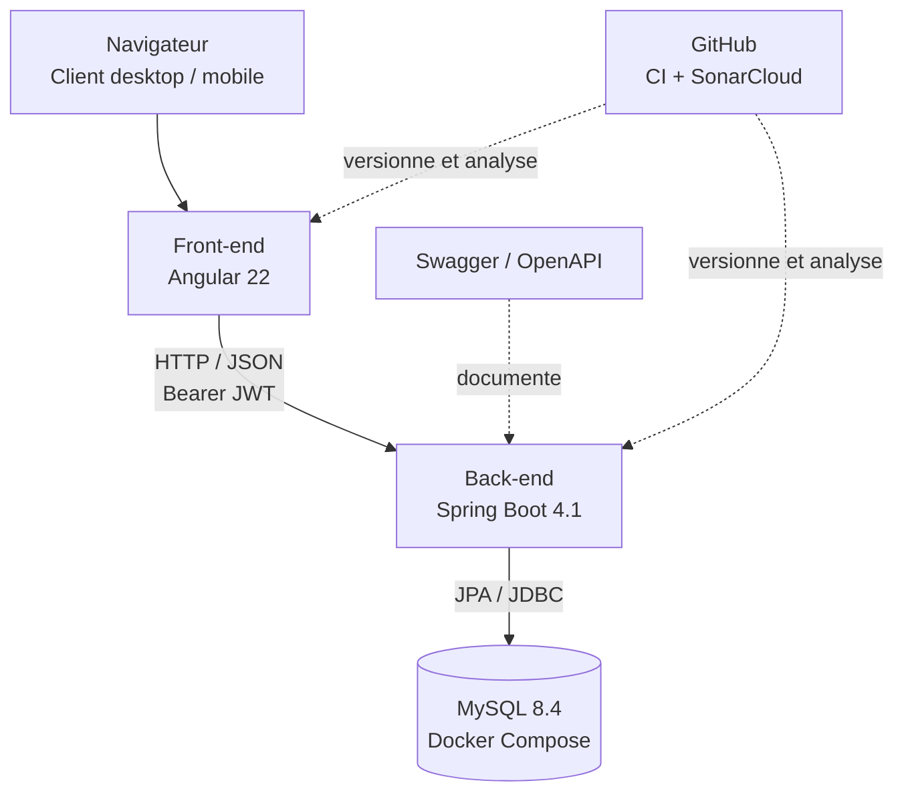

# MDD — Monde du Dév

MDD est une application web responsive de type réseau social destinée aux développeurs. Elle permet de suivre des thèmes techniques, de consulter un fil d'articles personnalisé, de publier, commenter et gérer son profil.

Le projet est organisé sous la forme d'un mono-repository contenant une application Angular et une API REST Spring Boot.

## Fonctionnalités

- Création de compte, connexion et déconnexion locale ;
- authentification par jeton JWT ;
- consultation et mise à jour du profil ;
- consultation des thèmes, abonnement et désabonnement ;
- fil d'actualité des articles liés aux thèmes suivis, avec tri chronologique ;
- création et consultation d'articles ;
- ajout et consultation de commentaires ;
- interface adaptée aux écrans desktop et mobile.

## Architecture



| Répertoire | Rôle                                                                         |
| ---------- | ---------------------------------------------------------------------------- |
| `front/`   | Application Angular, composants, services, tests Vitest et scénarios Cypress |
| `back/`    | API REST Spring Boot, sécurité JWT, persistance JPA et tests JUnit           |
| `docs/`    | Collection Postman et documentation complémentaire                           |

Le front-end est organisé par fonctionnalités, avec `core` pour les éléments transverses, notamment l'intercepteur JWT et les guards, et `shared` pour les éléments réutilisables. Le back-end suit une architecture en couches : contrôleurs REST, services métier, repositories JPA, DTO, mappers et sécurité.

## Stack technique

| Domaine           | Technologies                                                               |
| ----------------- | -------------------------------------------------------------------------- |
| Front-end         | Angular 22, TypeScript, Angular Material, SCSS, Signals, Vitest, Cypress   |
| Back-end          | Java 21, Spring Boot 4.1, Spring Security, JWT, Spring Data JPA, MapStruct |
| Base de données   | MySQL 8.4, Docker Compose, Testcontainers                                  |
| Documentation API | OpenAPI / Swagger UI, Postman                                              |
| Qualité           | ESLint, Prettier, JaCoCo, SonarCloud, GitHub Actions                       |

## Prérequis

- Node.js 22 ou version compatible avec Angular 22 ;
- JDK 21 ;
- Docker Desktop démarré : requis pour MySQL local, Testcontainers et les tests E2E ;
- Git.

## Installation et démarrage

Les applications front-end et back-end doivent être lancées dans deux terminaux distincts.

### 1. Configurer et démarrer l'API

Créer le fichier d'environnement local depuis le modèle fourni :

```bash
cd back
cp .env.example .env
```

Renseigner ensuite les valeurs locales dans `back/.env` :

```properties
DB_HOST=localhost
DB_PORT=3306
DB_NAME=mdd
DB_USER=mdd_user
DB_PASSWORD=change_me
DB_ROOT_PASSWORD=change_me_root
JWT_SECRET=change_this_to_a_long_random_secret
CORS_ALLOWED_ORIGINS=http://localhost:4200
```

Puis démarrer l'API :

```bash
./mvnw spring-boot:run
```

Lorsque Docker Desktop est disponible, Spring Boot démarre automatiquement le conteneur MySQL déclaré dans `back/compose.yaml`.

### 2. Démarrer l'application Angular

```bash
cd front
npm install
npm start
```

## Services locaux

| Service               | Adresse                                       |
| --------------------- | --------------------------------------------- |
| Application Angular   | <http://localhost:4200>                       |
| API REST              | <http://localhost:8080/api>                   |
| Swagger UI            | <http://localhost:8080/swagger-ui/index.html> |
| Spécification OpenAPI | <http://localhost:8080/v3/api-docs>           |

En développement, le proxy Angular redirige les requêtes `/api` vers l'API Spring Boot.

## Documentation de l'API

Swagger UI fournit la documentation interactive des endpoints, paramètres, schémas et réponses HTTP.

| Méthode | Endpoint | Description | Accès |
|---|---|---|---|
| `POST` | `/api/auth/register` | Créer un compte et obtenir un JWT | Public |
| `POST` | `/api/auth/login` | Se connecter avec un e-mail ou un nom d'utilisateur et obtenir un JWT | Public |
| `GET` | `/api/profile` | Consulter le profil de l'utilisateur connecté | JWT requis |
| `PUT` | `/api/profile` | Mettre à jour le profil de l'utilisateur connecté | JWT requis |
| `GET` | `/api/topics` | Lister les thèmes et l'état d'abonnement de l'utilisateur | JWT requis |
| `GET` | `/api/topics/options` | Lister les thèmes au format simplifié pour les champs de sélection | JWT requis |
| `GET` | `/api/topics/subscribed` | Lister les thèmes suivis par l'utilisateur | JWT requis |
| `POST` | `/api/topics/{topicId}/subscribe` | S'abonner à un thème | JWT requis |
| `DELETE` | `/api/topics/{topicId}/subscribe` | Se désabonner d'un thème | JWT requis |
| `GET` | `/api/posts` | Consulter le fil des articles des thèmes suivis ; paramètre `sort` optionnel : `asc` ou `desc` | JWT requis |
| `POST` | `/api/posts` | Créer un article lié à un thème | JWT requis |
| `GET` | `/api/posts/{postId}` | Consulter le détail d'un article | JWT requis |
| `GET` | `/api/posts/{postId}/comments` | Lister les commentaires d'un article | JWT requis |
| `POST` | `/api/posts/{postId}/comments` | Ajouter un commentaire à un article | JWT requis |

> La déconnexion est gérée côté client par suppression du JWT du stockage local ; l'API ne possède donc pas d'endpoint de déconnexion.

Une collection Postman est également disponible dans [docs/MDD.postman_collection.json](docs/MDD.postman_collection.json). Elle utilise les variables `baseUrl` et `token`.

## Sécurité

Les mots de passe sont hachés avec BCrypt et ne sont jamais retournés par l'API. Les endpoints protégés nécessitent un jeton JWT valide, transmis dans l'en-tête `Authorization: Bearer <token>`. Les DTO limitent les données échangées entre le client et les entités de persistance.

Le fichier `back/.env` contient les secrets locaux et est ignoré par Git. Ne le versionnez jamais ; utilisez uniquement le modèle [back/.env.example](back/.env.example).

## Tests et qualité

### Front-end

```bash
cd front
npm test                 # Tests Vitest
npm run lint             # Analyse ESLint
npm run e2e:coverage     # Scénarios Cypress et rapport de couverture E2E
npm run e2e:open         # Interface Cypress interactive
```

### Back-end

```bash
cd back
./mvnw test              # Tests unitaires
./mvnw verify            # Tests et rapport JaCoCo
```

Les tests d'intégration back-end utilisent Testcontainers avec une instance MySQL isolée. Le rapport JaCoCo est généré dans `back/target/site/jacoco/`.

Les tests E2E utilisent une base `mdd_e2e`, un back-end exécuté avec le profil `e2e` sur le port `8081` et un front-end sur le port `4201`. Cet environnement est supprimé à la fin de l'exécution ; il ne modifie pas la base de développement. Le rapport Cypress est généré dans `front/coverage/cypress/index.html`.

GitHub Actions exécute les tests front-end et back-end à chaque pull request et à chaque push sur `main`, avant l'analyse SonarCloud.

## Structure du projet

```text
.
├── front/
│   ├── src/app/core/        # Authentification, guards et intercepteur JWT
│   ├── src/app/features/    # Fonctionnalités métier : auth, posts, topics, user...
│   ├── src/app/shared/      # Composants, services et modèles réutilisables
│   └── cypress/             # Scénarios end-to-end
├── back/
│   ├── src/main/java/       # API, services, DTO, sécurité et persistance
│   ├── src/main/resources/  # Configuration et données initiales
│   ├── src/test/java/       # Tests unitaires et d'intégration
│   └── compose.yaml         # MySQL pour le développement local
├── docs/                    # Collection Postman
└── .github/workflows/       # Intégration continue
```

## Variables d'environnement

| Variable                                                                | Description                                                         |
| ----------------------------------------------------------------------- | ------------------------------------------------------------------- |
| `DB_HOST`, `DB_PORT`, `DB_NAME`, `DB_USER`, `DB_PASSWORD`               | Paramètres de connexion MySQL                                       |
| `DB_ROOT_PASSWORD`                                                      | Mot de passe administrateur MySQL du conteneur local                |
| `JWT_SECRET`                                                            | Clé de signature des jetons JWT                                     |
| `CORS_ALLOWED_ORIGINS`                                                  | Origine autorisée du front-end, par exemple `http://localhost:4200` |
| `E2E_DB_NAME`, `E2E_DB_USER`, `E2E_DB_PASSWORD`, `E2E_DB_ROOT_PASSWORD` | Configuration de la base dédiée aux tests E2E                       |
| `E2E_JWT_SECRET`, `E2E_CORS_ALLOWED_ORIGINS`                            | Configuration JWT et CORS du profil E2E                             |

## Axes d'amélioration

- Ajouter une pagination et, si nécessaire, un mécanisme de cache pour les articles et commentaires ;
- envisager le stockage du JWT dans un cookie `HttpOnly`, associé à une protection CSRF ;
- charger les routes Angular à la demande afin de réduire le JavaScript initial ;
- compléter les tests d'accessibilité, notamment sur les composants Angular Material ;
- étendre l'usage des façades pour les pages coordonnant plusieurs services ;
- enrichir les logs applicatifs pour faciliter le diagnostic en production.
